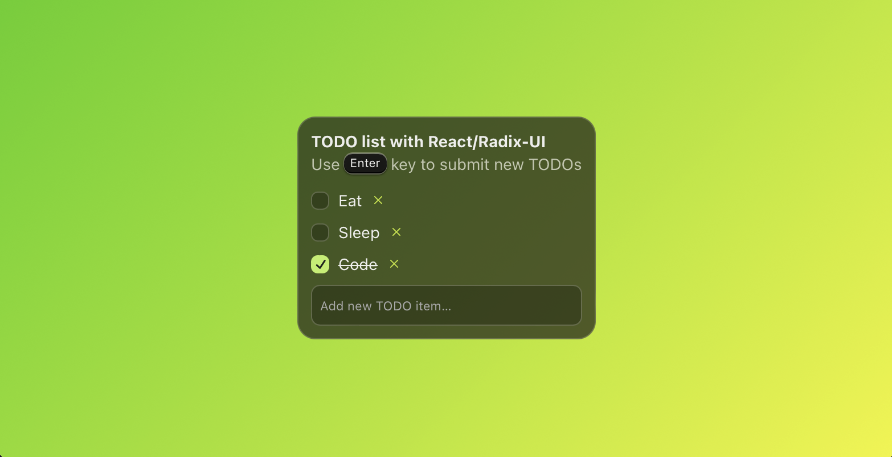

# Simple TODO app built with React and Radix-UI

Check out [Radix-UI](https://www.radix-ui.com/).

Predecessor example of [todo-master](https://github.com/jandoerntlein/todo-remaster/).



## Build and run
```sh
npm i
npm start
```
